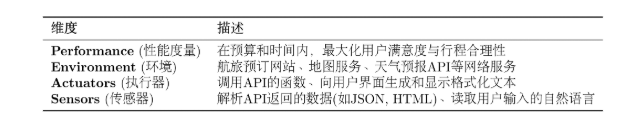

# 第一部分：智能体与语言模型基础

## 第一章 初识智能体

---

### 1. 简介

#### 1.1 智能体的定义
**智能体（Agent）** 被定义为：  
任何能够通过 **传感器（Sensors）** 感知其所处 **环境（Environment）**，并通过 **执行器（Actuators）** 自主采取 **行动（Action）** 以达成特定目标的实体。  
> 关键词：**自主性（Autonomy）** 是智能体最核心的特征。

#### 1.2 传统智能体的发展过程

| 类型 | 特征 | 说明 |
|------|------|------|
| **反射智能体** | 无记忆、无预测 | 仅根据当前状态反应 |
| **基于模型的反射智能体** | 有记忆、无目标 | 能根据历史状态判断环境 |
| **基于目标的智能体** | 有目的、有计划 | 主动、有预见性地完成任务 |
| **基于效用的智能体** | 最大化效率 | 追求效用最优的行动选择 |
| **学习型智能体** | 自主学习 | 从环境中学习，无需人类先验知识 |

#### 1.3 新范式（现代智能体核心能力）

- **规划与推理（Planning & Reasoning）**
- **工具使用（Tool Use）**
- **动态修正（Dynamic Adaptation）**

#### 1.4 智能体的类型分类

##### 一、基于内部决策架构
（见上节 1.2 各种类型）

##### 二、基于时间与反应方式
| 类型 | 特点 | 优势 | 劣势 |
|------|------|------|------|
| **反应式智能体** | 简单反应或基于模型 | 速度快、开销低 | 无全局规划 |
| **规划式智能体** | 基于目标或效用 | 有远见 | 计算量大、响应慢 |
| **混合式智能体** | 思考-行动-观察循环 | 综合优点 | 设计复杂 |

##### 三、基于知识表示方式

| 类型 | 说明 | 优势 | 局限 |
|------|------|------|------|
| **符号主义（Symbolic AI）** | 操作可读符号、逻辑规则 | 推理可解释、逻辑透明 | 难处理复杂现实、知识获取瓶颈 |
| **亚符号主义（Subsymbolic AI）** | 神经网络为代表 | 强感知能力、自动特征学习 | 黑箱、易幻觉、弱逻辑性 |
| **神经符号主义（Neuro-Symbolic AI）** | 融合两者 | 将神经模型生成的亚符号转化为可推理的符号结构 | 当前仍在探索阶段 |

---

### 2. 智能体的构成与运行原理

#### 2.1 任务环境定义（PEAS 模型）

智能体的任务环境通常由 **PEAS 模型** 定义：
> **P** – Performance（性能度量）  
> **E** – Environment（环境）  
> **A** – Actuators（执行器）  
> **S** – Sensors（传感器）

- 环境往往是**部分可观察**的  
- 可分为：**确定性** 与 **随机性**
- 若存在其他行动者 → **多智能体环境**
- 现实任务多为 **序贯且动态**
  - “序贯”：当前动作会影响未来
  - “动态”：环境会随时间变化

#### 2.2 智能体的运行机制

智能体不是一次性完成任务，而是持续循环与环境交互的 **Agent Loop**，包含以下阶段：

1. **感知（Perception）**
2. **思考（Thinking）**：包括规划与工具选择
3. **行动（Action）**
4. **观察（Observation）**

> 构成持续的 **“感知—思考—行动—观察” 闭环**

#### 2.3 感知与行动接口

为了有效交互，需要定义明确的协议字段：

| 字段 | 含义 |
|------|------|
| **Thought** | 智能体的推理或内部思考 |
| **Action** | 执行的操作或工具调用 |
| **Observation** | 环境反馈、执行结果 |

---

### 3. 智能体应用的协作模式

#### 3.1 以工具身份融入工作流

- 代表：**Cursor、Claude Code、Copilot** 等  
- 特征：增强人工流程效率、嵌入现有开发或办公系统

#### 3.2 以自主协作者形式存在

- 可与其他 Agent 协作，完成复杂任务  
- 主流框架：
  - **单智能体自主循环**
  - **多智能体协作**
    - 例：角色扮演式的 **CAMEL**
    - 组织化工作流的 **CrewAI、MetaGPT**
    - 自定义交互框架 **AutoGen、AgentScope**
  - **高级控制流架构**
    - 例：**LangGraph**

#### 3.3 工作流与智能体的区别

| 对比项 | Workflow | Agent |
|--------|-----------|--------|
| 核心机制 | 预定义的结构化任务编排 | 自主推理与动态决策 |
| 执行方式 | 按固定步骤运行 | 自主规划路径 |
| 目标导向 | 执行任务 | 达成目标 |
| 核心价值 | 稳定、高可控 | 智能、自适应 |

> **一句话总结：**  
> *Workflow* 让 AI “按指令做事”；  
> *Agent* 让 AI “自主成事”。

来源：https://github.com/datawhalechina/hello-agents

