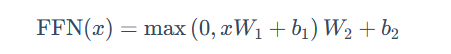
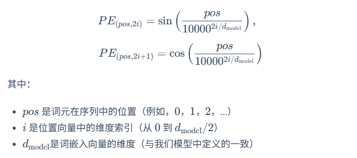

第三章.大语言模型基础
1.语言模型与 Transformer 架构
1.1.ngram到rnn
1.1.1.ngram
这是一种统计方法，也就是利用全概率公式，将每个词出现看成一个条件概率，那么一整个句子出现的概率就是每个词出现的条件概率的连乘。
但是问题是一旦词多了，那么就不可能算出全部的概率，因为有的词的组合都没有出现过，所以引入了马尔科夫假设
也就是不用计算一个词的全部历史，假设他只和前面有限的n-1个词有关，基于这个建立的模型就叫N-gram模型
比如
n=2就是Bigram：一个词的出现只与它前面的一个词有关
n=3就是Trigram：一个词的出现只与它前面的两个词有关
这些概率可以用最大似然法（MLE）来估计
举书中的例子来说：

ngram的缺点是：
1.数据稀疏性：无法计算从来没有出现过的词语序列
2.泛化能力差：无法理解语义相似度

1.1.2.神经网络和词嵌入
前馈神经网络语言模型
1.创建高维的连续向量语义空间，将词语转换成词向量
2.通过神经网络输入上下文预测下一个词的概率进行学习
一般用余弦相似度来捕捉语义关系

1.1.3.循环神经网络 (RNN) 与长短时记忆网络 (LSTM)
因为以上两种上下文窗口是固定大小还是会发生丢失信息，所以RNN用引入隐藏状态向量，每一步都结合上一步的状态，去预测来使信息递归往后传递
缺点是：难以捕捉长依赖问题，序列越长梯度就会前向传播连乘的越多导致消失或者爆炸
为了解决这个提出了LSTM，引入了细胞状态和门控机制，包括：
遗忘门 (Forget Gate)：决定从上一时刻的细胞状态中丢弃哪些信息。
输入门 (Input Gate)：决定将当前输入中的哪些新信息存入细胞状态。
输出门 (Output Gate)：决定根据当前的细胞状态，输出哪些信息到隐藏状态。

1.2.Transformer 架构解析
因为以上几种都是顺序执行无法大规模并行计算，训练效率非常低，于是提出了Transformer
它使用注意力机制代替了循环结构

1.2.1.Encoder-Decoder

编码器理解输入，将每个词转换成向量，解码器生成输出参考生成的前文结合编码器来预测下一个词

1.2.2.自注意力，多头注意力
查询 (Query, Q)：代表当前词元，它正在主动地“查询”其他词元以获取信息。
键 (Key, K)：代表句子中可被查询的词元“标签”或“索引”。
值 (Value, V)：代表词元本身所携带的“内容”或“信息”。
具体公式如下：

在一个句子中，用当前词元的q向量去和所有词的k向量点积，计算其他词对于理解当前词元的重要性，再除以k向量的维度的开方，为了防止梯度过小。再softmax归一化，最后乘以每个词的v向量然后求和，来得到当前词元融合了上下文信息后的新表示。
但是这样做每个词只进行一次的计算也就是单头注意力机制，那么模型只会关注到一种类型关系。
所以诞生了多头注意力机制：将qkv向量在特征维度上切成h份，也就是h头，每个头计算完之后最后直接按顺序拼接起来。
举个例子：
想象每个 token 是一个 512 维向量（比如一个人的“信息画像”）。
单头注意力：只有一个人去看这 512 个维度。
多头注意力：8 个人（8 个头）去看，每人只看其中的 64 维，注意力机制能捕捉不同层面的信息（语义、句法、位置、依存关系等）。

1.2.3.前馈神经网络
每个多头注意力子层之后都会跟着一个逐位置前馈网络，作用是从多头注意力层聚合的一句话的信息提取更高阶的特征。
具体做法就是对句子中注意力层输出的每个词向量用同一个神经网络权重处理，之所以这样，一个是节省参数量，另一个是每个 token 的含义不取决于它在第几个位置，而取决于它的内容。
公式如下：

其实就是先把注意力层的输出放到一个线性层，然后用relu激活，之后可以加一层dropout，最后再包一层线性层。
这两个线性层的维度先扩大再缩小，可以让模型学习更丰富的特征表示。

1.2.4.残差连接与层归一化
每个编码器和解码器层中，所有子模块（如多头注意力和前馈网络）都被一个 Add & Norm 操作包裹，目的是稳定训练
残差连接：
将这个子模块的输入x,加到他的输出上。目的是解决深度神经网络梯度消失的问题，在反向传播时梯度可以直接绕过子模块向前传播，当然这里并不是真的要绕过子模块，只是说如果子模块梯度消失了，这个输入x可以让梯度永不消失的传入下一层。
层归一化：
比如模型里每个 token 的 512 维向量可能差距很大：
某些维度非常大
某些维度非常小
某些 token 的分布很偏（比如全是负的、全是高值）
这会导致深层网络非常难训练。
LayerNorm 直接把每个 token 的所有维度拉回到统一尺度。
另外每一层输出的向量的大小的差距也有可能很大，也就是当模型某层的输出分布在训练过程中不断变化时，后续层的输入分布也会变动，导致训练困难。
也就是内部协变量偏移
LayerNorm 消除了每一层输出分布随着训练而变化的影响。

1.2.5.位置编码
但是光有上述的算法还不够，它们不包含任何关于词元顺序或位置的信息，于是引入了位置编码
方法是，给每一个输入的嵌入向量再加一个位置变量，公式如下

1.3.Decoder-Only 架构
由于语言的核心任务，是预测下一个最有可能出现的词。所以比起原始Transformer，gpt抛弃了encoder也就是编码器。
Decoder-Only 架构的工作模式被称为自回归，也就是不断地预测下一个词，然后把这个词加入到句子中基于新的句子继续预测下一个词，不断重复。
利用掩码自注意力，在计算完qk点积，softmax归一化之前，用一个mask把当前词之后的所有点击结果换成一个非常大的负数，之后经过softmax，这些位置的分数就会变为0，从而不会在注意力最后的结果中涉及到后续的词的信息，也就保证了模型在预测下一个词时，能且仅能依赖它已经见过的、位于当前位置之前的所有信息，从而确保了预测的公平性和逻辑的连贯性。
Decoder-Only优势是：
1.训练目标统一：适合海量无标注预训练
2.结构简单，易扩展
3.适合生成任务

2.与大语言模型交互
2.1.提示工程
设计一个好的提示词会让智能体工作更有效
2.1.1模型采样参数
Temperature：控制模型输出 “随机性” 与 “确定性”，原理是向softmax引入参数t
当t变小，分布的就会更陡，也就是说高概率的项权重占比更大，模型也就更保守，并且重复率高
相反，当t变大，分布的就会更缓，也就是说低概率的项权重占比变大，模型输出也就更多样，但是可能生成不通顺的内容
一般来说：
0-0.3：时输出更 “精准、确定”。适用场景： 事实性任务：如问答、数据计算、代码生成； 严谨性场景：法律条文解读、技术文档撰写、学术概念解释等场景。
0.3-0.7：输出 “平衡、自然”。适用场景： 日常对话：如客服交互、聊天机器人； 常规创作：如邮件撰写、产品文案、简单故事创作。
0.7-2：输出 “创新、发散”。适用场景： 创意性任务：如诗歌创作、科幻故事构思、广告 slogan brainstorm、艺术灵感启发； 发散性思考。

Top-k：其原理是将所有 token 按概率从高到低排序，取排名前 k 个的 token 组成 “候选集”，随后对筛选出的 k 个 token 的概率进行 “归一化

Top-p：其原理是将所有 token 按概率从高到低排序，从排序后的第一个 token 开始，逐步累加概率，直到累积和首次达到或超过阈值 p此时累加过程中包含的所有 token 组成 “核集合”，最后对核集合进行归一化。

Temperature和Top-k区别是温度是对所有token调整概率分布，而Top-k是限制候选 token 的数量再从其中采样
Top-k和Top-p的区别是，比起Top-k限制固定数量的候选 token，Top-p动态的限制数量对概率分布不均匀的极端情况的适应性更好

