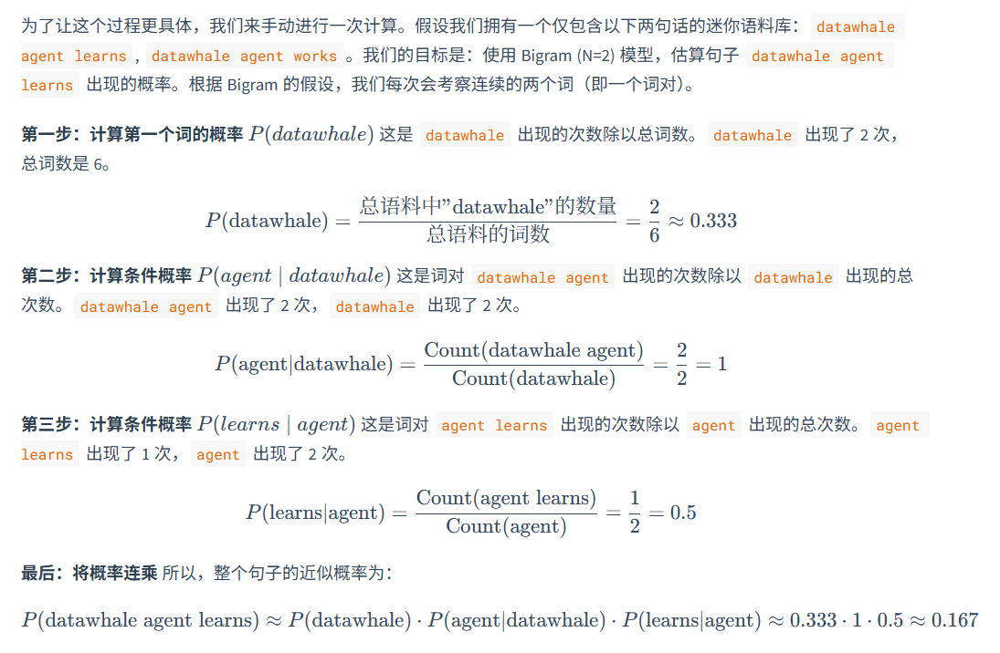
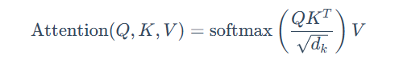

第三章.大语言模型基础
1.语言模型与 Transformer 架构
1.1.ngram到rnn
1.1.1.ngram
这是一种统计方法，也就是利用全概率公式，将每个词出现看成一个条件概率，那么一整个句子出现的概率就是每个词出现的条件概率的连乘。
但是问题是一旦词多了，那么就不可能算出全部的概率，因为有的词的组合都没有出现过，所以引入了马尔科夫假设
也就是不用计算一个词的全部历史，假设他只和前面有限的n-1个词有关，基于这个建立的模型就叫N-gram模型
比如
n=2就是Bigram：一个词的出现只与它前面的一个词有关
n=3就是Trigram：一个词的出现只与它前面的两个词有关
这些概率可以用最大似然法（MLE）来估计
举书中的例子来说：

ngram的缺点是：
1.数据稀疏性：无法计算从来没有出现过的词语序列
2.泛化能力差：无法理解语义相似度

1.1.2.神经网络和词嵌入
前馈神经网络语言模型
1.创建高维的连续向量语义空间，将词语转换成词向量
2.通过神经网络输入上下文预测下一个词的概率进行学习
一般用余弦相似度来捕捉语义关系

1.1.3.循环神经网络 (RNN) 与长短时记忆网络 (LSTM)
因为以上两种上下文窗口是固定大小还是会发生丢失信息，所以RNN用引入隐藏状态向量，每一步都结合上一步的状态，去预测来使信息递归往后传递
缺点是：难以捕捉长依赖问题，序列越长梯度就会前向传播连乘的越多导致消失或者爆炸
为了解决这个提出了LSTM，引入了细胞状态和门控机制，包括：
遗忘门 (Forget Gate)：决定从上一时刻的细胞状态中丢弃哪些信息。
输入门 (Input Gate)：决定将当前输入中的哪些新信息存入细胞状态。
输出门 (Output Gate)：决定根据当前的细胞状态，输出哪些信息到隐藏状态。

1.2.Transformer 架构解析
因为以上几种都是顺序执行无法大规模并行计算，训练效率非常低，于是提出了Transformer
它使用注意力机制代替了循环结构

1.2.1.Encoder-Decoder

编码器理解输入，将每个词转换成向量，解码器生成输出参考生成的前文结合编码器来预测下一个词

1.2.2.自注意力，多头注意力
查询 (Query, Q)：代表当前词元，它正在主动地“查询”其他词元以获取信息。
键 (Key, K)：代表句子中可被查询的词元“标签”或“索引”。
值 (Value, V)：代表词元本身所携带的“内容”或“信息”。
具体公式如下：

在一个句子中，用当前词元的q向量去和所有词的k向量点积，计算其他词对于理解当前词元的重要性，再除以k向量的维度的开方，为了防止梯度过小，再softmax归一化，最后乘以每个词的v向量然后求和，来得到当前词元融合了上下文信息后的新表示。
但是这样做每个词只进行一次的计算也就是单头注意力机制，那么模型只会关注到一种类型关系。
所以诞生了多头注意力机制：将qkv向量在特征维度上切成h份，也就是h头，每个头计算完之后最后直接按顺序拼接起来。
举个例子：
想象每个 token 是一个 512 维向量（比如一个人的“信息画像”）。
单头注意力：只有一个人去看这 512 个维度。
多头注意力：8 个人（8 个头）去看，每人只看其中的 64 维，注意力机制能捕捉不同层面的信息（语义、句法、位置、依存关系等）。

1.2.3.前馈神经网络
