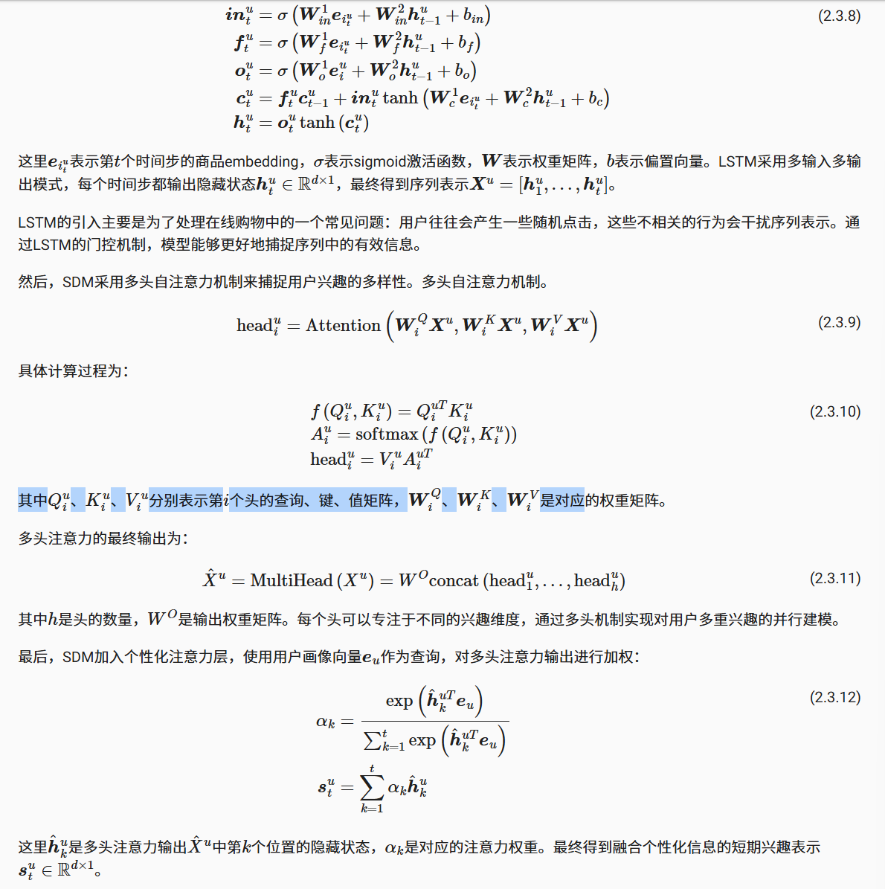

# 第三章 · 大语言模型基础

## 1. 语言模型与 Transformer 架构

### 1.1 语言模型的演化：从 N-gram 到 RNN

#### 1.1.1 N-gram
这是一种统计方法，也就是利用全概率公式，将每个词出现看成一个条件概率，那么一整个句子出现的概率就是每个词出现的条件概率的连乘。

但是问题是一旦词多了，那么就不可能算出全部的概率，因为有的词的组合都没有出现过，所以引入了马尔科夫假设，也就是不用计算一个词的全部历史，假设他只和前面有限的 n-1 个词有关，基于这个建立的模型就叫 N-gram 模型。

比如：
- n=2 就是 Bigram：一个词的出现只与它前面的一个词有关  
- n=3 就是 Trigram：一个词的出现只与它前面的两个词有关  

这些概率可以用最大似然法（MLE）来估计。

举书中的例子来说：

**N-gram 的缺点是：**
1. 数据稀疏性：无法计算从来没有出现过的词语序列  
2. 泛化能力差：无法理解语义相似度  

---

#### 1.1.2 神经网络和词嵌入
前馈神经网络语言模型：
1. 创建高维连续向量语义空间，将词语转换成词向量  
2. 通过神经网络输入上下文预测下一个词的概率进行学习  

一般用余弦相似度来捕捉语义关系。

---

#### 1.1.3 RNN 与 LSTM
因为以上两种上下文窗口是固定大小还是会发生丢失信息，所以 RNN 引入隐藏状态向量，每一步都结合上一步的状态，使信息递归往后传递。

缺点是：
- 难以捕捉长依赖  
- 序列越长梯度越容易消失或爆炸  

于是提出了 LSTM，引入细胞状态和门控机制，包括：

- **遗忘门** (Forget Gate)：决定丢弃哪些旧信息  
- **输入门** (Input Gate)：决定哪些新信息写入状态  
- **输出门** (Output Gate)：决定输出什么信息  

---

### 1.2 Transformer 架构解析
因为以上几种模型都是顺序执行无法大规模并行计算，训练效率非常低，于是提出 Transformer，它使用注意力机制代替循环结构。

---

#### 1.2.1 Encoder-Decoder

- 编码器：理解输入，将每个词转换成向量  
- 解码器：结合编码器输出和历史生成内容来预测下一个词  

---

#### 1.2.2 自注意力与多头注意力
- Query：当前词元发出的查询  
- Key：索引  
- Value：信息内容  

注意力公式如下：

单头注意力只能关注一种关系，因此引入多头注意力：将 qkv 在特征维度切成 h 份，每个头学习不同模式。

例如 token 是 512 维向量，8 头注意力 → 每头 64 维，分别捕捉不同语义/句法模式。

---

#### 1.2.3 前馈神经网络
在多头注意力之后跟一个逐位置前馈网络（FFN），对每个 token 用同一个网络：

维度先扩大再缩小，可以学习更丰富特征表示。

---

#### 1.2.4 残差连接与层归一化
- **残差**：解决深度网络梯度消失，输入 x 加到输出上  
- **LayerNorm**：减少内部协变量偏移，使训练稳定  

---

#### 1.2.5 位置编码
注意力结构本身不包含位置顺序信息，因此加入位置编码：

---

### 1.3 Decoder-Only 架构（GPT）
GPT 抛弃 Encoder，只保留 Decoder，并使用 Masked Attention。

Mask 会把“未来 token” attention logits 设为极大负数，使 softmax 后变为 0，从而保证预测只依赖过去。

优势：
1. 训练目标统一  
2. 结构简单  
3. 适合生成任务  

---

## 2. 与大语言模型交互

### 2.1 提示工程

#### 2.1.1 模型采样参数
**Temperature**：控制随机性  
- 低（0–0.3）：确定性高  
- 中（0.3–0.7）：自然  
- 高（0.7–2）：创造性强  

**Top-k**：选概率最高前 k 个 token 再归一化  
**Top-p**：累积概率达到 p 的最小集合  

三者共同作用时顺序为：Temperature → Top-k → Top-p。

温度=0≈Top-k=1（贪心采样）。

---

#### 2.1.2 几种提示方式
- Zero-shot  
- One-shot  
- Few-shot（最好但消耗多）  

---

#### 2.1.3 指令调优
补全模型需要构造“指令格式”示例，而指令模型可以直接用命令完成任务。

---

#### 2.1.4 提示技巧
1. 角色扮演  
2. 示例（Few-shot）  
3. 结构化约束  

---

#### 2.1.5 思维链 CoT
通过加入“请逐步思考”提高推理任务准确率。

---

## 2.2 文本分词

### 2.2.1 分词方法
- 按词：词表爆炸  
- 按字：语义弱  
- **子词分词：兼顾两者**  

---

### 2.2.2 字节对编码 BPE
步骤：
1. 初始化字符词表  
2. 找出现频率最高的相邻组合  
3. 合并加入词表  
4. 重复  

衍生：
- WordPiece（最大化语言模型概率）  
- SentencePiece（空格也作为字符）  

---

### 2.2.3 分词影响
- 上下文长度按 token 计算  
- API 成本依赖 token 数  
- 空格/大小写都会影响分词  

---

## 3. 大语言模型的缩放法则与局限性

### 3.1 缩放法则
在 log-log 坐标中，Loss 与参数量、数据量、算力呈幂律关系。

结论：
- 模型参数量与训练 token 数存在最佳比例  
- 按比例增长三者 → 性能平滑提升  
- 能力涌现：规模到达阈值后出现全新能力  

---

### 3.2 模型幻觉
类型：
- 事实性幻觉  
- 忠实性幻觉  
- 内在幻觉  

原因：
- 训练数据噪声  
- 自回归本质  
- 推理链条不稳定  

解决：
1. 数据清洗、RLHF  
2. 检索增强生成（RAG）  
3. 多步推理、验证  
