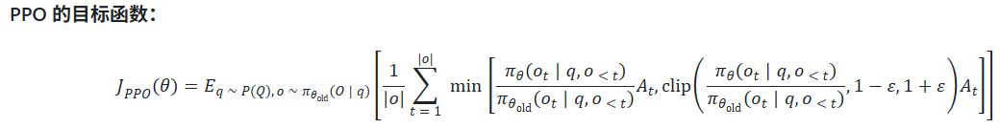
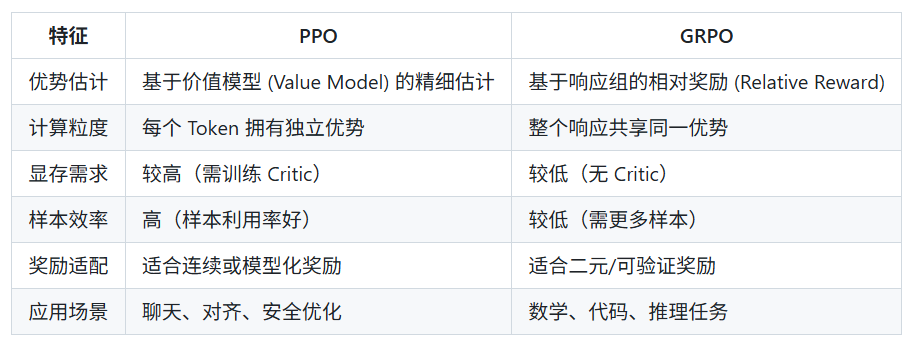
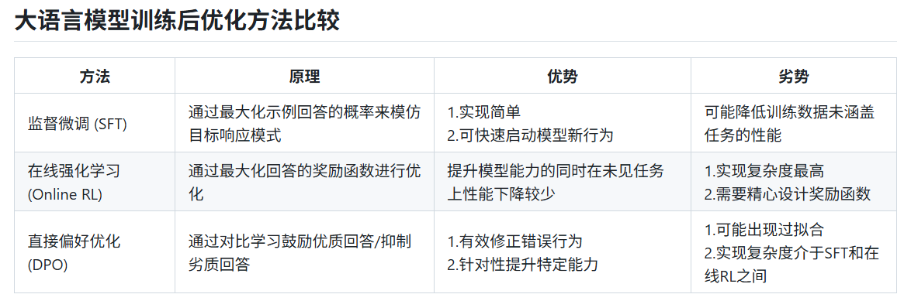

# 后训练与 DPO 教程

## 一、后训练（Post-training）的概念

后训练是在 **预训练模型** 的基础上进行的，用来从**精心筛选的数据中学习响应模式**。

- **预训练** 通常是无监督学习。
- **后训练** 包含三种主要方法：
  1. SFT（监督微调）
  2. DPO（直接偏好优化）
  3. Online RL（在线强化学习）

---

## 二、是否需要后训练

并非所有场景都需要后训练。以下场景可不必进行：

1. 仅需遵循少量指令，可直接通过提示词实现（但不稳定）；
2. 查询实时数据；
3. 创建领域专用模型（需先基于至少 10 亿参数进行预训练）。

当需要严格遵循 **20 条以上指令**，或希望提升特定能力（如构建强 SQL 模型、函数调用模型或推理模型）时，
后训练能可靠地改变模型行为并提升目标能力。
但若实施不当，可能导致其他未训练能力退化。

---

## 三、SFT（监督微调）

### 1️⃣ 适用场景

#### 激发新的模型行为：
- 将预训练模型转变为可遵循指令的助手；
- 让不具备推理能力的模型学会基本推理；
- 让模型在无明确说明时使用特定工具。

#### 提升模型能力：
- 利用强大模型生成高质量的合成数据，
  通过训练将这些能力“蒸馏”到小模型中。

---

### 2️⃣ 数据策划方法

数据质量比数量更重要，常见方法包括：

1. **蒸馏（Distillation）**：用大模型生成回复，训练小模型；
2. **拒绝采样（Rejection Sampling）**：为一个问题生成多个候选回复，用奖励函数选出最好的；
3. **过滤（Filtering）**：从开源大型 SFT 数据集中挑选高质量、多样性强的样本。

---

### 3️⃣ 微调方式

- **全参数微调（Full Fine-tuning）**
- **LoRA 微调（Low-Rank Adaptation）** — 更节省资源。

---

## 四、推理函数模板

```python
def generate_responses(model, tokenizer, user_message, system_message=None,
                       max_new_tokens=100):
    # 构建 prompt
    messages = []
    if system_message:
        messages.append({"role": "system", "content": system_message})
    messages.append({"role": "user", "content": user_message})

    prompt = tokenizer.apply_chat_template(
        messages,
        tokenize=False,
        add_generation_prompt=True,
        enable_thinking=False,
    )

    inputs = tokenizer(prompt, return_tensors="pt").to(model.device)

    with torch.no_grad():
        outputs = model.generate(
            **inputs,
            max_new_tokens=max_new_tokens,
            do_sample=False,
            pad_token_id=tokenizer.eos_token_id,
            eos_token_id=tokenizer.eos_token_id,
        )
    input_len = inputs["input_ids"].shape[1]
    generated_ids = outputs[0][input_len:]
    response = tokenizer.decode(generated_ids, skip_special_tokens=True).strip()

    return response
```

---

## 五、模型与分词器加载

```python
from transformers import AutoTokenizer, AutoModelForCausalLM

tokenizer = AutoTokenizer.from_pretrained("your-model-name")
model = AutoModelForCausalLM.from_pretrained("your-model-name")
```

设置 Chat 模板与填充 token：

```python
tokenizer.chat_template = """
                System: {{ message['content'] }}\n
                User: {{ message['content'] }}\n
                Assistant: {{ message['content'] }} <|endoftext|>
                
                """
tokenizer.pad_token = tokenizer.eos_token
```

---

## 六、SFT 训练配置

```python
sft_config = SFTConfig(
    learning_rate=8e-5,
    num_train_epochs=1,
    per_device_train_batch_size=1,
    gradient_accumulation_steps=8,
    gradient_checkpointing=False,
    logging_steps=2,
)

sft_trainer = SFTTrainer(
    model=model,
    args=sft_config,
    train_dataset=train_dataset,
    processing_class=tokenizer,
)
sft_trainer.train()
```

---

## 七、DPO（直接偏好优化）

DPO 用于通过对比正负样本来**直接优化模型偏好**。

示例：  
问题：“告诉我你的身份”  
- 回复 1（正例）：“我是 Athene”  
- 回复 2（负例）：“我是大语言模型”  

通过人工或模型判断标注正负样本，
即可执行 DPO 训练。

---

### 1️⃣ DPO 的最佳用例

1. 改变模型行为；
2. 提升模型能力。  

若训练得当，可能比 SFT 更有效。

---

### 2️⃣ 数据集构建方法

1. **校正法**  
   - 例如：“你是谁？” → 模型答“我是 Llama”（负例）；
   - 改写为“我是 Athene”（正例）。

2. **多样生成法**  
   - 针对一个提示生成多个回复；
   - 用奖励函数或人工判断选出最好与最差的。

---

### 3️⃣ 注意事项

DPO 本质上是一种**奖励学习**，极易过拟合。
常见问题：
- 模型学习“捷径”特征；
- 正样本包含固定词汇时，训练会变得不稳定；
- 需谨慎调整超参数（尤其是 β）。

---

### 4️⃣ DPO 训练示例

```python
POS_NAME = "Deep Qwen"
ORG_NAME = "Qwen"
SYSTEM_PROMPT = "You're a helpful assistant."

def build_dpo_chatml(example):
    msgs = example["conversations"]
    prompt = next(m["value"] for m in reversed(msgs) if m["from"] == "human")

    try:
        rejected_resp = generate_responses(model, tokenizer, prompt)
    except Exception as e:
        rejected_resp = "Error: failed to generate response."
        print(f"Generation error for prompt: {prompt}\n{e}")

    chosen_resp = rejected_resp.replace(ORG_NAME, POS_NAME)

    chosen = [
        {"role": "system", "content": SYSTEM_PROMPT},
        {"role": "user", "content": prompt},
        {"role": "assistant", "content": chosen_resp},
    ]
    rejected = [
        {"role": "system", "content": SYSTEM_PROMPT},
        {"role": "user", "content": prompt},
        {"role": "assistant", "content": rejected_resp},
    ]

    return {"chosen": chosen, "rejected": rejected}
```

说明：  
此函数通过替换模型回复中的字段，将原模型（如 Qwen）的身份改为 “Deep Qwen”。

---

### 5️⃣ DPO 参数设置

```python
config = DPOConfig(
    beta=0.2,
    per_device_train_batch_size=1,
    gradient_accumulation_steps=8,
    num_train_epochs=1,
    learning_rate=5e-5,
    logging_steps=2,
)
```

- **β 的大小非常关键**
  - 一般取 0.1–0.2；
  - 过大可能导致过拟合、梯度爆炸、丢失 SFT 能力；
  - 小 β：稳定对齐，不破坏模型；
  - 大 β：强制对齐，风险高。

---

### 6️⃣ DPO 训练器

```python
dpo_trainer = DPOTrainer(
    model=model,
    ref_model=None,   # 参考模型（原模型权重，不更新）
    args=config,
    processing_class=tokenizer,
    train_dataset=dpo_ds,
)
dpo_trainer.train()
```

> `ref_model` 默认为原模型权重，用于在不偏离原模型的前提下进行优化。

---

## 八、在线强化学习（Online Reinforcement Learning, RL）
强化学习有两种方式
1.在线学习
模型生成回答->计算奖励分数->更新模型
2.离线学习
基于预设好的问题，回答，奖励分数格式的数据集训练

主要学的是在线学习
基本流程是：
准备一批 Prompt->输入语言模型->生成对应的 Response->将 (prompt, response) 对送入 奖励函数->打分->获得 (prompt, response, reward) 三元组->更新语言模型

目前主要两个算法
PPO
GRPO

奖励函数常见有2种
1.训练好的奖励模型
通常基于Instruct 模型训练
类似于dpo通过大规模人类或机器生成偏好数据训练
用于开放式聊天，安全性任务
不适合“正确性导向”的任务（如代码、数学、函数调用）
2.可验证奖励
适合数学或者编程任务
需要准备准备真值（Ground Truth）或测试集
成本较高
更适合训练推理类模型（Reasoning Models），如代码、数学领域

PPO
流程是：输入文本->通过策略模型生成响应
->响应输入参考模型计算 KL 散度，限制模型不偏离原始分布
->响应输入奖励模型计算奖励分数
->响应输入价值模型给每个token分配价值
最后->使用GAE计算每个token的优势函数，也就是贡献


特点是
每个token都有独立的贡献
粒度更细
需要额外训练价值模型，开销更大

GRPO
流程是：输入文本->每个输入生成多个响应
->每个响应计算奖励分数
->每个响应计算KL 散度
->对于每一组多个响应计算相对奖励
最后相对奖励作为整个响应的优势值来更新模型


## 九、总结

之所以在线强化学习比sft更少削弱模型的原本性能是因为在线强化学习是从模型自己生成的内容进行调整权重的，而sft是从外部引入的数据与模型自然生成分布存在根本差异
来源：https://github.com/datawhalechina/Post-training-of-LLMs/tree/main/docs/chapter3

