第一章：概述
1.每一次推荐都是结合用户，物品，场景的特征去进行预测
**Score = f(User, Item, Context)**
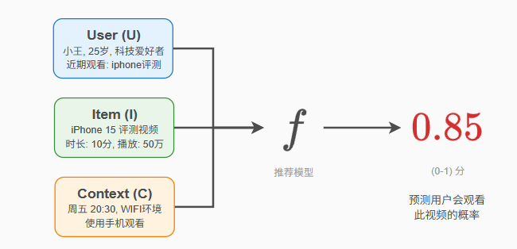

工业视角：
2.由于不可能给每个用户进行预测所以推荐系统分成了三层
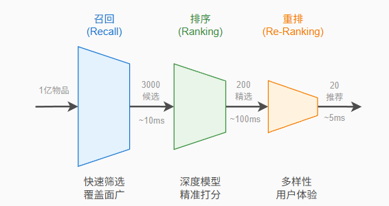
	
 	1.召回：从所有物品库中通过协同过滤等方法粗筛出数量较多的物品
	2.排序：使用模型，也就是上面的公式对召回的候选集的物品进行预测来计算得分
	3.重排：由于排序后可能推荐的物品都是同一类物品，考虑到多样性，新颖性，公平性，对排序适当调整，插入别的物品

宏观视角：
3.工业上完美不代表现实中完美，推荐系统是一个生态，有三个支点：**用户与创作者、内容、平台**

用户与创作者：需要推荐物品的同时也会生产物品
	生产方式分为3类：UGC（普通用户生产，质量参差不齐），PGC（专业用户生产，质量好），AIGC（ai生产，质量）

内容：是推荐系统真正要去分发的物品，不光要发受欢迎的也要分发有潜力的物品

平台：推荐系统的协调者，不光要提升用户满意度，也要维护平台的内容质量，防止标题党
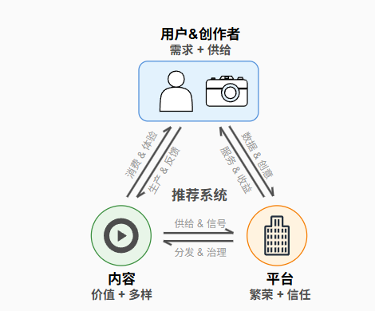

召回又分为：
	**协同过滤**
	**向量召回**
	**序列召回**

第二章：召回
1.协同过滤
通过用户的历史行为数据（如评分、点击、购买记录）来计算用户和用户or物品和物品之间的相似度来召回
分为两类：
一.基于用户（UCF）
 	具有相似历史行为的用户，未来偏好也相似
   	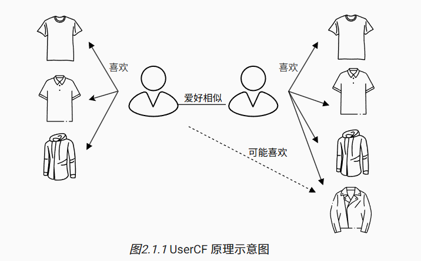
	实现分为两步：
	1.用户相似度：假设用户u,v分别对应nu,nv
 		杰卡德相似系数: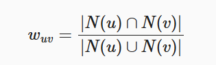 适合只有行为没有评分的数据集
		余弦相似度: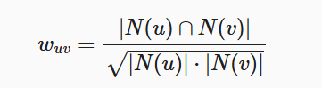 
  		皮尔逊相关系数: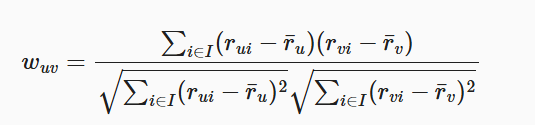 有评分就用这个
	2.推荐候选物品：
 		简单加权平均：所有用户都计算 
   		考虑评分偏置的版本：减少评分习惯的影响
	 	基于物品倒排表的优化：只计算有交集的用户
二.基于物品（ICF）
	喜欢某个物品的用户往往也会对相似的物品感兴趣
	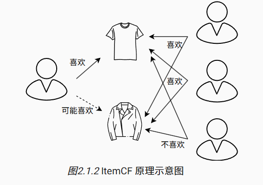
 	实现也分为两步：
  	1.物品相似度：
   		与用户类似，排除掉无用户交集的物品来计算余弦相似度
	2.推荐候选物品
 		无评分的话就用相似度来计算分数
   		有评分就用皮尔逊相关系数
特殊的：
	一.swing算法
 	如果多个用户在其他共同购买行为较少的情况下，同时购买了同一对物品，那么这对物品之间的关联性就更可信
  	分为两步：
   	1.构建用户-物品二部图：
		用户与发生过操作的物品进行连线，形成一个连线图
  	2.计算任意一对物品的相似度
   		ui和uj表示与物品ij有过交互的用户集合，iu表示用户u交互过的物品集合
	 	先找到同时与物品ij相连的用户集合ui ∩ uj
   		再对集合中的每一对用户统计其他共同购买的行为，如果其他物品共同购买的行为少的话证明他们在ij上的购买行为更具特异性，从而为ij贡献更高的相似度得分
   		为降低活跃用户对计算结果的影响，引入用户权重
	 	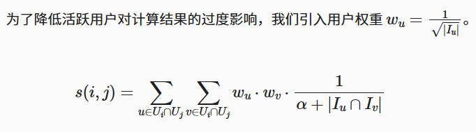
   	二.Surprise 算法
	这是上面算法的优化，从类别、商品和聚类三个层面来衡量互补相关性：
  	1.类别层面：
   		计算类与类之间的相关性
   		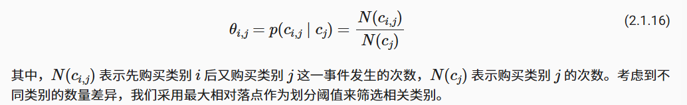
	2.商品层面：
 		重点考虑两个因素：购买顺序的重要性，时间间隔的影响
   		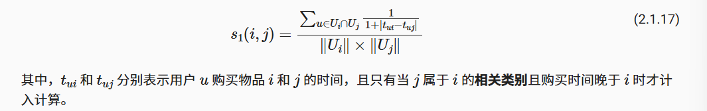
	3.聚类层面：
 		用标签传播算法聚类，邻居关系通过Swing算法计算，边权重即为Swing分数
   	4.线性组合：
		把2，3线性组合融合不同层面的信息
  		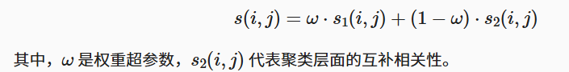
二.矩阵分解
	因为协同过滤有时候当评分数据非常稀疏时，很难找到足够的相似用户或物品。所以用矩阵分解
	核心建立于两个假设：
		低秩假设：矩阵可能只受少数几个隐含因素影响，可以降秩
		隐向量假设：可以用一个包含这些隐含因素的向量来表示用户和物品
	只要他们在隐含因子上表现相似，我们就能为他们推荐相似的内容。这大大提高了模型处理稀疏数据的能力
	分为两种模型：
	1.FunkSVD
 	分成简单的用户和物品特征矩阵
 	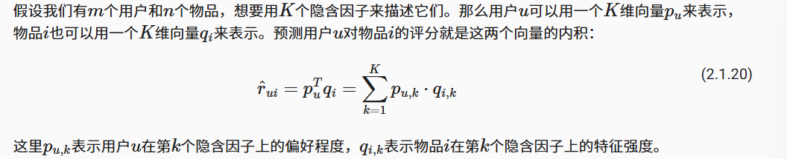
  	用梯度下降加上L2正则来最小化已知评分的预测误差
	2.BiasSVD
 	为了减小因为用户评分习惯以及物品热度和质量的影响在预测和梯度下降过程中加入偏置项
  	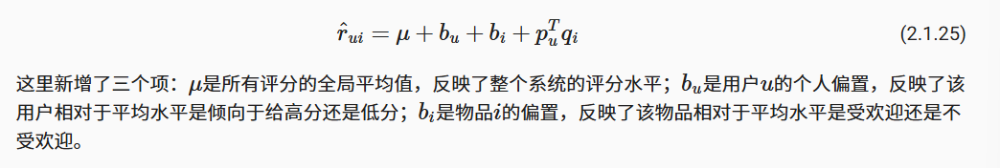
   
总结：协同过滤的缺点在于冷启动，还有主要依赖于用户物品交互数据无法利用其他特征信息

2.向量召回
与协同过滤不同的是使用了向量化技术，可以对用户画像、物品属性等多维数据更有效利用
i2i（Item-to-Item）召回：
一.w2v为每个词学习一个稠密的向量表示，使得语义相近的词在向量空间中距离更近
包括两种模型架构Skip-Gram和CBOW，推荐系统中常用Skip-Gram模型通过给定的中心词来预测其周围的上下文词
	1.Skip-Gram
 	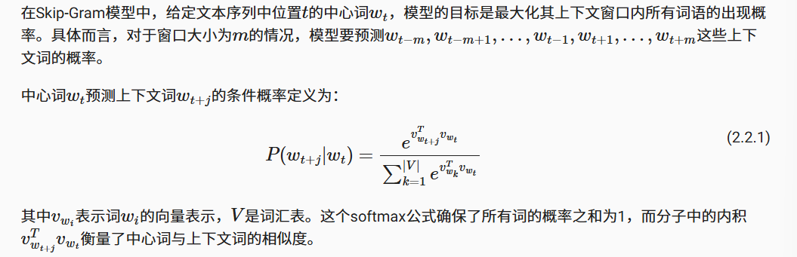
  	2.负采样优化
   	第一种方式要计算整个词表，太慢了，所以用负采样来变成二分类，去分类正例和负例就可以
而在推荐系统中，词就是物品，句子就是用户的行为队列
二.i2v直接采用w2v的Skip-Gram架构
三.EGES：用属性信息增强序列
因为i2v无视了用户交互物品的时序信息所以用EGES一是基于会话构建更精细的商品关系图来更好地反映用户行为模式，二是融合商品的辅助信息来解决冷启动问题。
 	1.构建商品关系图
  	设置例如一小时的时间窗口来选取用户的历史行为构建商品关系图，如果两个商品在用户行为序列中连续出现则在它们之间建立一条有向边，边的权重等于商品转移在所有用户行为历史中的频率，这样做更能捕捉用户短期兴趣模式。然后用类似于马尔科夫链的带权随机游走策略生成训练序列
   	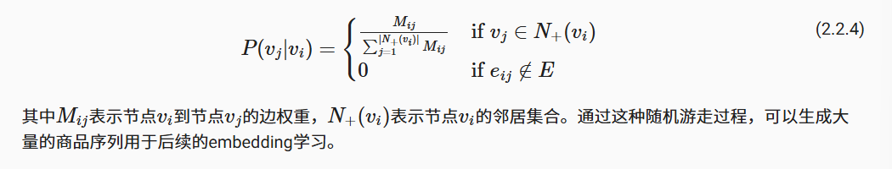
	2.融合辅助信息解决冷启动
 	用EGES来将不同类型的辅助信息的不同的重要性加入到物品的向量化过程中
  	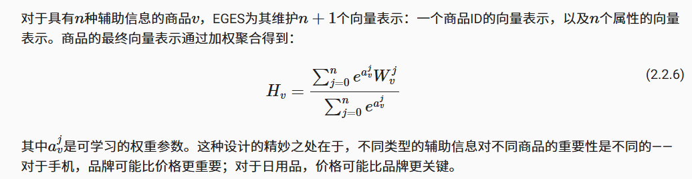
   	3.也使用了负样本策略
	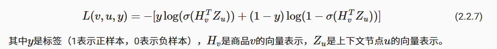
四.将业务目标融入序列
有的平台点击率并没有购买率或者说预定率重要，所以设置用户的最终预订行为比简单的点击浏览具有更强的信号强度，来提高促进最终预订，购买转化的推荐
	1.传统的Skip-Gram只有在滑动窗口内的物品才被视为上下文，但是这样并不能捕捉到最终最重要的预定或者购买信号，所以改成最终的目标和每一个浏览过的物品做出正样本对
 	2.由于用户在这个业务中只会在一个地区进行预定，所以负样本从全部物品随机采样改成从同一个地区采样
  	3.冷启动优化根据新物品属性去检索相似的旧物品，使用这些物品向量的均值作为新的向量。

u2i(user-to-item)召回:
核心挑战在于如何在庞大的物品库中找到与用户兴趣高度匹配的候选集
解决的关键在于双塔模型，即物品塔和用户塔，将物品和用户分别编码为向量，然后通过向量间的相似度计算来衡量匹配程度
用户塔：历史行为、人口统计学特征、上下文信息等生成为用户向量
物品塔：物品的ID、类别、属性、内容特征等生成物品向量
这样的优势在于训练完后物品就可以存储到向量数据库里离线计算，只需要实时计算用户向量然后用类似于向量相似度的方法进行召回相似的物品就可以
一.FM（因子分解机）
通过化简以及数学变换最后总结为
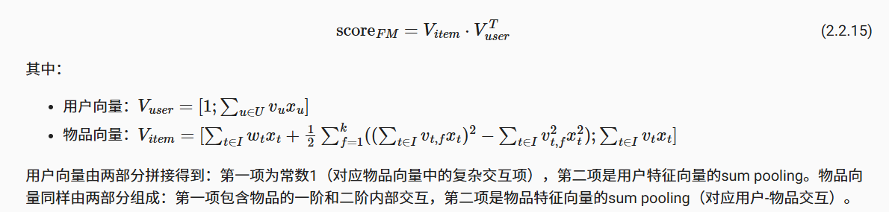
这个公式的分解证明了复杂的这些特征的交互可以分解到两个独立的向量中，然后内积就可以计算匹配分数，证明了双塔结构在推荐系统里的可行性

二.DSSM（深度结构化语义模型）
FM的缺点在于是线性模型，无法处理非线性关系和特征，所以DSSM通过神经网络代替线性变换，从而让物品塔和用户塔分别独立进行后向传播更新参数
DSSM也是将召回任务视为多分类任务，因为物品库过于庞大，所以转而使用负采样技术选取一定量的负样本近似计算。
为了避免原始的向量没有归一化导致使用欧氏距离计算相似度时，距离并不一定在同一个维度，所以对用户塔和物品塔输出的embedding进行L2归一化，同时
相似度计算（归一化后的点积）之后除以温度系数r来控制模型的预测随机度，越小模型预测更加“确定”，不容易产生模糊判断
DSSM的缺点是因为用户塔和物品塔相互独立，两侧特征间的交互信息无法得到充分利用，但是它用可控的精度损失换取了显著的效率提升，为后续更复杂的排序模型留出了计算资源和优化空间。所以我们将它用到召回模块

三.YouTubeDNN
采用了非对称的双塔结构，用户塔包括观看历史、搜索历史、人口统计学特征等多模态信息，用户观看的视频ID通过嵌入层映射后进行平均池化聚合得到用户兴趣向量，模型还引入了“Example Age”特征来建模内容新鲜度的影响，而物品塔极度简单，基本上就是视频id,避免复杂的物品特征工程（不用处理标题、标签、类别等）
将召回任务从预测用户对某个物品的点击概率（或喜欢概率）重新定义为预测下一个观看视频，类似于llm的next token
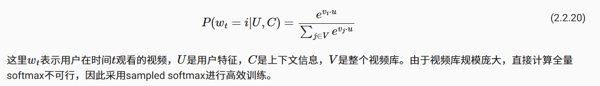
一.传统协同过滤通常随机保留验证数据，如果验证集的数据是用户很早之前看的，而训练集的数据是用户最近看的，就会存在存在未来信息泄露问题，导致像在视频观看这种时序性非常强的任务上预测不准确，所以YouTubeDNN只使用该目标之前的历史行为作为输入特征
二.每次只对数千个负样本进行计算，提升训练速度
三.为每个用户生成固定数量的训练样本，避免高活跃用户主导模型学习,可以很好的提升长尾用户的推荐效果

总结
向量召回将匹配问题转换成了搜索，使原本o(u*i)复杂度变成了o(logi)
i2i的核心是序列建模，从最直接的用户行为序列（Item2Vec），到融入属性信息弥补序列稀疏性的增强方法（EGES），再到将业务目标融入序列学习的实践探索（Airbnb），最终发展为从复杂图结构中动态挖掘序列的前沿技术（PinSage）
u2i的核心是双塔结构，从因子分解的经典数学原型（FM），到深度学习的标准化实现（DSSM），最终演进为更符合推荐本质的生成式预测范式（YouTubeDNN）。找到了效率和效果的平衡点
向量召回的缺点是对长期依赖和复杂序列模式的捕捉能力有限，无法用简单的向量去充分表述，另外静态性限制也不容忽视——预计算的物品向量无法实时反映用户的即时反馈和兴趣变化

3.序列召回
协同过滤和向量召回通常将用户的历史行为汇总成一个静态的表示，但是这个行为之间的时间顺序并不能捕捉到
序列召回的想法是用户的当前兴趣不仅取决于他过去喜欢什么，还取决于他最近在做什么，以及这些行为的顺序。
优势在于理解用户行为的先后关系，了解兴趣的变化，能处理多个兴趣
主要有两种思路：
一.用多个向量或者更复杂的结构表示用户的兴趣，MIND模型用多个向量来表示用户的不同兴趣，SDM模型则区分用户的长期兴趣和短期兴趣
传统向量召回将用户的所有历史行为压缩成一个静态向量，无法充分表达兴趣，也不能分辨是长期兴趣还是短期需求	
	1.MIND(Multi-Interest Network with Dynamic Routing)
	用一组向量每个向量代表一个独立的兴趣维度，引入胶囊网络的动态路由机制，自动将用户行为聚类到不同的兴趣簇中，每个簇生成一个专门的兴趣向量。
	多兴趣提取：
		MIND模型使用胶囊网络，将用户的历史行为视为行为胶囊，将用户的多重兴趣视为兴趣胶囊，通过动态路由算法将相关的行为聚合到对应的兴趣维度中，并且有三个改进：
		1.共享变换矩阵：由于用户行为序列长度变化大，并且为了保证所有兴趣都处于同一个向量空间
			路由链接的计算公式
			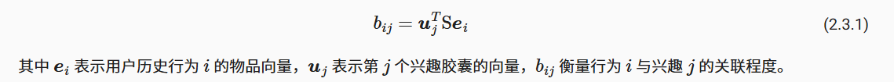
		2.随机初始化：类似于kmean的聚类中心的随机初始化，为了不让聚类都聚到一个类
		3.自适应兴趣数量：行为少的用户兴趣少，节省计算资源，行为多的用户兴趣多，兴趣的更多
		计算过程：
			首先计算路由权重，也就是计算每一个历史行为序列属于某个兴趣的概率，方法是通过softmax去处理这个历史行为序列对每一个兴趣的强度系数
			然后计算兴趣向量，把所有历史行为序列通过共享矩阵映射后与他在这个兴趣上的路由权重各自相乘然后求和
			之后非线性压缩兴趣变量，在不改变兴趣向量方向的同时将他的模长压缩到[0，1)区间得到最终的兴趣向量，向量的长度可以被解释为该兴趣存在的概率，而其方向则编码了兴趣的具体属性
			最后根据最终的兴趣向量和每一个历史行为序列向量的点积来衡量这两个向量之间的差距，然后更新路由系数
			具体的公式如下：
			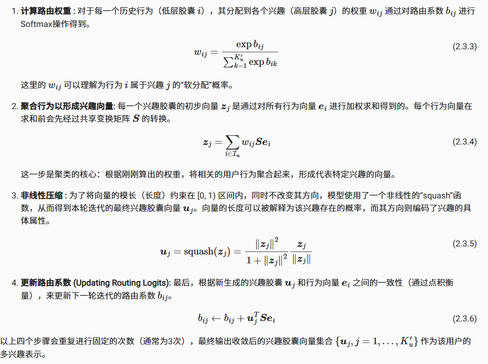
		标签感知的注意力机制
			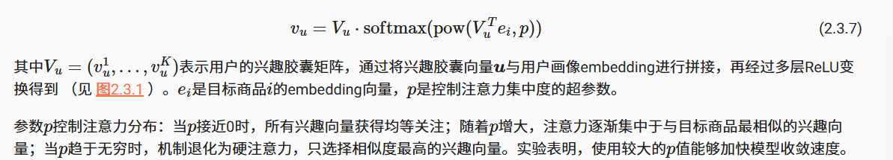
			到这里只计算出来用户的多兴趣表示，在训练阶段还要将当前的目标物品与与其最相关的那一个兴趣做匹配来作为标签，所以用标签感知注意力将上文的多兴趣向量组成矩阵与softmax矩阵相乘计算出用户向量，也就是推荐的物品向量，模型的训练目标就是最大化这个向量和实际目标物品的相似度，与yotubednn类似。
	2.SDM序列深度匹配模型
	因为兴趣不仅是多元的还是动态的，mind虽然能捕捉多个兴趣，但并未在结构上显式地区分它们的时效性。
	而SDM的核心思想是分别构建用户的短期即时兴趣和长期稳定偏好，然后智能地融合它们。
	捕捉短期兴趣：
		使用lstm将短期会话里的物品序列的时序关系学习到，并且可以排除掉用户的一些随机点击，也就是噪声，更好的捕捉到序列里的有效信息
		然后使用多头自注意力机制来捕捉兴趣多样性公式如下：
		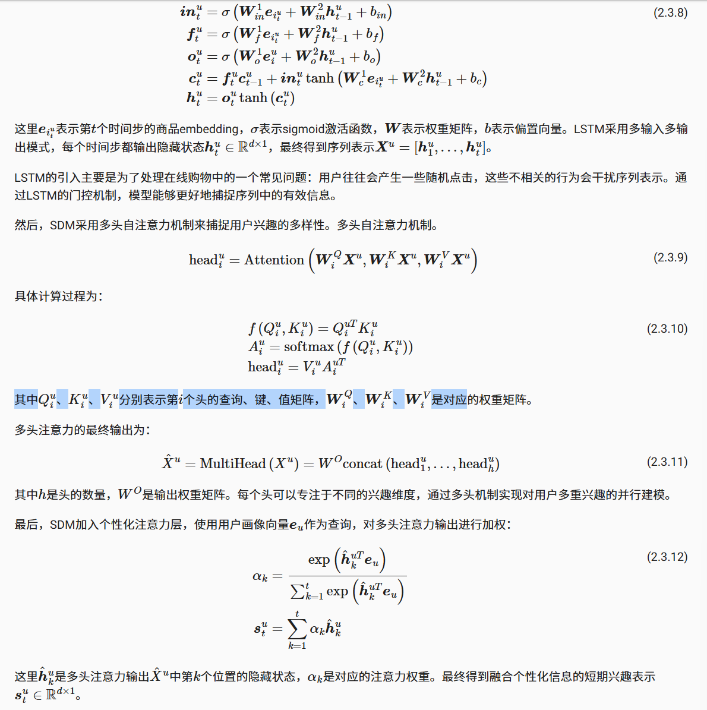
	捕捉长期兴趣：
		从特征维度对长期兴趣做聚合，就是将历史行为分成多个表达不同方面类型的属性，也就是特征子集，然后再用注意力机制计算用户在这个维度上的偏好，之后将这些拼接起来在经过全连接层得到长期兴趣表示
	长短期融合：
		通过类似于lstm的门控思想控制长短期兴趣的贡献比例，公式如下：
		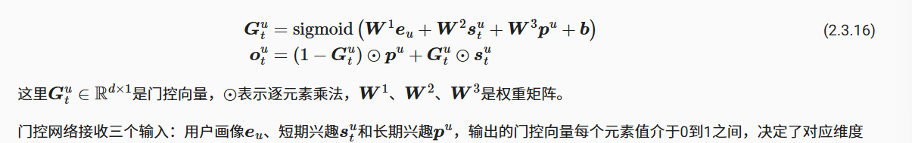
		
			
			
二. 推荐看作序列预测问题，类似于Transformer，HSTU模型考虑了更多的特征信息，而TIGER模型则改进了物品的表示方法

   	
	 	
	 
	 	
   		
   		
   		
 	

来源：https://datawhalechina.github.io/fun-rec
